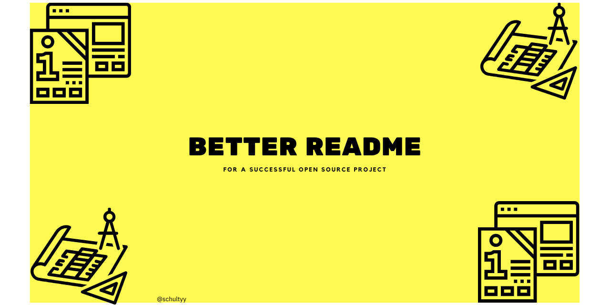

# Better README's for a successful Open Source project

You have been busy working on a new open source project. Once you start talking about it, it's challenging to get the attention.
Does that sound familiar?

It's likely people looking at your project don't see how it could benefit them. Either, they need to solve different use cases, or your README doesn't address their requirements effectively.

When you look at a new project, where do you usually start?
It's likely the project's GitHub page. Next to the brief description on the top you will look at the `README` file.
The `README` is your project's business card. It's selling your project - selling, as in "Does that project look useful to me?" or "Could I see myself use this in production?"

## How does a good README file look like?

Firstly, we'll look at some key points for your project's README, followed by tips and tricks for using the right language to address and market your project.

### Introduction

First of all, let's explain what the project is about. What does it do, for whom is it interesting?

Here's an example from [Deno](https://github.com/denoland/deno):

> Deno is a simple, modern and secure runtime for JavaScript and TypeScript that uses V8 and is built in Rust.

That's step one. Now, in the next sentence, let's explain who our target user is. We want to make sure a visitor can determine if the project is relevant for them (and then keeps reading):

> If you want to run TypeScript natively and need to run code in a security-conscious enviroment, Deno is your choice. Grant explicit permissions for I/O to ensure a maximum of security.

### Installation

Explain in simple steps, how can the user install the project or library on their machine. Depending on my operating system, include different instructions if necessary.

For instance (again, using Deno as an example):

> Shell (Mac, Linux):

`curl -fsSL https://deno.land/x/install/install.sh | sh`

> PowerShell (Windows):

`iwr https://deno.land/x/install/install.ps1 -useb | iex`

Optional: Include instructions how users can compile a version from source.

### Getting Started

How can users get started with the *least* number of steps possible? This is your opportunity to shine with your "Hello World" equalivant (Deno's example):

`$ deno run https://deno.land/std/examples/welcome.ts`

### Contributing

Do you allow and accept outside contributions? What's the process to submit changes? Explain, how users should use GitHub Issues for this project.
Explain how they can submit code changes to your project. For instance:

1. Fork this project.
2. Check out a new branch: `git checkout -b feature-branch`.
3. Make Changes.
4. Commit Changes `git add . && git commit`.
5. Open a Pull Request against this project's `main` branch.

> In your PR description, please explain why you submitted the PR and all other necessary context.

## Addressing users

### Active Language

Use active language to describe your project and steps users need to take. For instance:

> Visit [link](https://example.com) to find the Getting Started Guide.

And avoid:

> A getting started guide can be found [here](https://example.com).

### Write for your users

> I chose to implement these features because I needed it for a use case.

How does that make you feel when you read it? Probably not very convincing. Instead of writing for yourself, what do your users need and expect?
It can be challenging sometimes changing perspective, because you're focused on a lot of details. Take a step back and when you look at your project from a user's perspective, what information would you expect to read about?

### How to describe your project

Depending on the type of project, adapt your description. Let's consider two examples.

#### Security / Safety motivation, using [Devise](https://github.com/heartcombo/devise) as an example

Devise is a Ruby library to help developers implement authentication in their [Rails](https://rubyonrails.org/) application.

A developer implementing authentication features needs to make sure their users can safely log in, so their accounts needs to be safe and secure.
How do you feel when you are working on security-related features?
Unmet security requirements are often stress-inducing, therefore you need to reduce stress as much as possible.

__How can you alleviate stress?__

1. Emphasize that the library is well-tested and uses established protocols and mechanisms to implement authentication.
2. When you talk about your libraries advantages, talk about what you prevent from happening, such as "Prevent unauthorized access to your application"

#### New approaches to do something with [Hotwire](https://hotwire.dev) as an example

Hotwire is an alternative approach to building modern web applications without using much JavaScript by sending HTML instead of JSON over the wire.

Compared to other techniques and libraries, it's a new approach. People looking at it might not have any idea how it could be useful.
Therefore, Hotwire requires different language to explain it to users compared to Devise, as well as additional content to demonstrate use cases.

Do you know this feeling you have when you just learned something new and now all you think about are the countless possibilities of things you can do now?

That's the feeling to instill in your users. When they learn about Hotwire for the first time.

How can you achieve that?

Two things:

1. Show them, how straightforward it is to use Hotwire to define user interfaces.
2. Show them a lot of examples for different use cases.

Enable your users to imagine, what great things they could achieve, if they used Hotwire.

## Contributing

If you have additional tips and tricks for a good README, follow these steps:

1. Fork this repository
2. Check out a new branch: `git checkout -b feature-branch`.
3. Add your tips and tricks to this README file.
4. Commit Changes `git add . && git commit`.
5. Open a Pull Request against this project's `main` branch on GitHub.

## License

MIT
